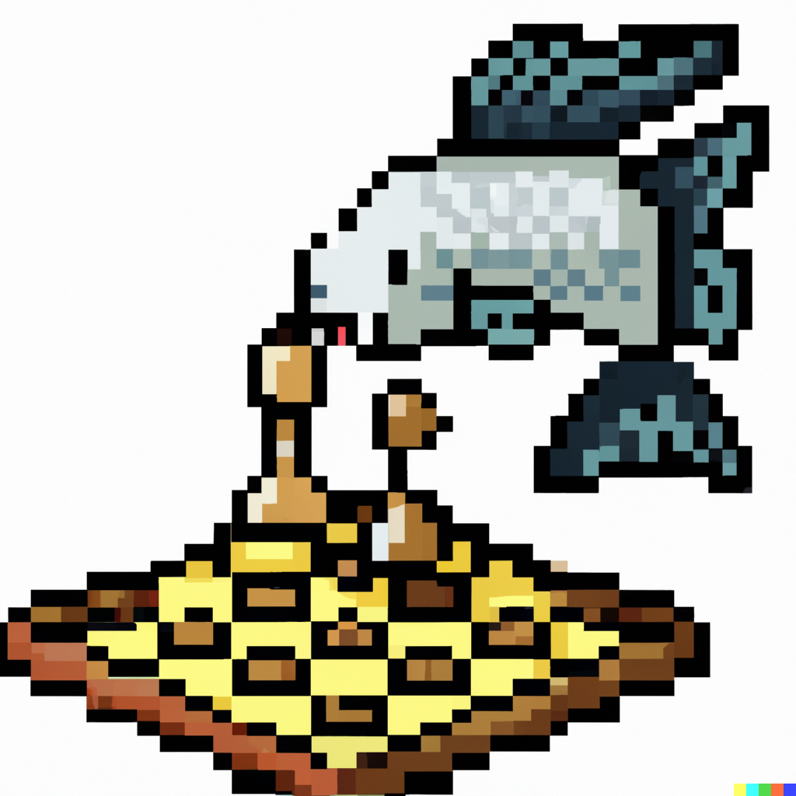

# Betafish

Betafish - An amalgamation of AlphaZero and Stockfish.

Play it [here](https://betafish.gavinong.com).

## Introduction

Betafish is a chess engine and AI move finder written in Javascript, based on the Negamax algorithm. It beats Stockfish Level 5 on Lichess, and I estimate its around 1800-2000 Elo, depending on the thinking time afforded.

## Features

- Negamax algorithm with alpha-beta pruning
- Move ordering using the MVV-LVA heuristic
- Principal variation search
- Quiescence search
- Iterative deepening
- Piece-square tables

This enables Betafish to search to a depth of 7-8 plies and around ~1mil possible nodes, given a thinking time of around 1-2 seconds.

## Possible Improvements

- Transposition tables
- Zobrist hashing
- Opening tables

Of course, re-writing this in a compiled language like C++ would be a huge improvement. I wrote it in Javacript as I wanted to deploy it as a web app, as what fun would a game be without letting your friends challenge it? However, I quickly realised the limitations, as JS is definitely not suited for these computing-intensive tasks.

## Credits

- [Chess Engines: A Zero to One](https://www.chessengines.org/) - The article that jumpstarted my journey into chess programming.
- [WukongJS](https://github.com/maksimKorzh/wukongJS) - A JS chess engine, written by Maksim Korzh, who was patient enough to answer my questions, give me pointers and point me in the right direction in this journey.
- [Bluefever Software's YouTube series](https://www.youtube.com/watch?v=2eA0bD3wV3Q&list=PLZ1QII7yudbe4gz2gh9BCI6VDA-xafLog) - A 63-part series on chess programming, which was an absolute gold mine and served as inspiration for the bulk of the chess engine.
- [Chess Programming Wiki](https://www.chessprogramming.org/Main_Page) - A great resource for chess programming.
- [Chessboard.js](https://chessboardjs.com/) - The library I used for the GUI.
